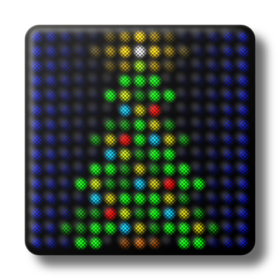

# Christmas Tree App

---

Festive Christmas Tree for your Lightpad Block - [see it in action!](https://www.instagram.com/p/BsG6yCYB9jI/)

Tap the Star to make it shine and play the specified note (with velocity, pitch bend and channel pressure).
Tap the block anywhere else to make it snow (and toggle the specified MIDI CC to ON).
Tap again to melt the snow away (and toggle MIDI CC to OFF).
The Mode button controls the blinking of the lights.

---

## Installation

1. Make sure you have [ROLI Dashboard](https://roli.com/products/software/blocks-dashboard) installed.

2. Run the installer for your operating system (on Mac you may need to right click the installer and click "Open").

3. Launch ROLI Dashboard and select the app to load it into your Lightpad Block and tweak its parameters ("Edit" button).

