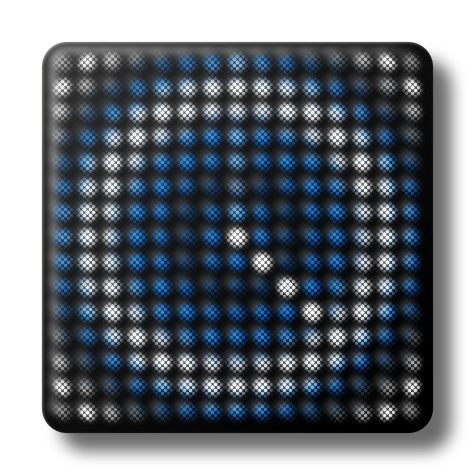

# Polar Pad

---

### Download: [ [Polar Pad 0.5](https://github.com/anthonyalfimov/Lightpad-Block-Sandbox/releases/tag/Polar-Pad-v0.5) ]

---

This app outputs MIDI based on the radial and angular position of your finger. Just one finger though, don't get too excited.
